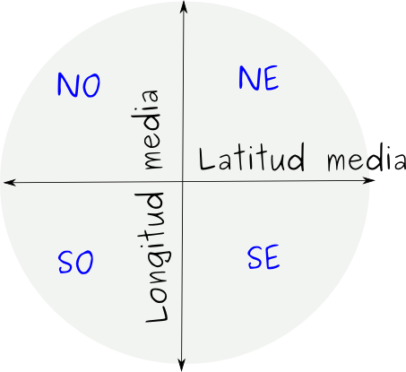

# R13 Condicionales {-}

## ifelse (RR)

Usaremos el objeto **_iris_** que viene instalado con el R. Asignar **_iris_** a un nuevo objeto al que llamaremos **_miX_**. 

```{r, comment=""}
miX <- iris
head(miX)
```

Generaremos una nueva variable que llamaremos **_categoria_**. A esta variable le asignaremos la categoría "Grande" para aquellos registros que cumplan la condición simultánea de que _Sepal.Length_ sea mayor al valor de la mediana del vector  _Sepal.Length_ y  _Sepal.Width_ sea mayor al valor de la mediana del vector _Sepal.Width_, el resto de los registros serán categorizados como "Pequeños". Como primer paso se podría calcular el valor medio de esas variables mediante **_apply()_** 


<!-- RTA -->
```{r, echo= F}
med <- apply(miX[1:4], 2, median)
med
miX$categoria <- ifelse(miX$Sepal.Length > med[1] & miX$Sepal.Width > med[2], "Grande", "Pequeño" )
```

Si está bien resuelto la función table de miris$categoría debería dar

```{r, comment= ""}
table(miX$categoria)
```

## ifelse (RRR)

Asignar a un objeto que llamaremos **_env_** la tabla contenida en el archivos DoubsEnv.csv, que se encuentra en la carpeta 4-Datos (la descripción de la base de datos se encuentra en el archivo [datos_eer.html](datos_eer.html)). 

Generar una nueva variable a la que llamaremos _**cuadrante**_. Cada registro tomará valores de cuadrantes (NO, NE, SO y SE) de acuerdo a su posición respecto de de los valores medios de latitud y longitud de **_env_**. Por ejemplo, a aquellos registros cuyo valor de latitud y longitud sean mayores que el valor medio de las variables lon y lat respectivamente se les asignará el texto NE, como se muestra en la siguiente figura

{width=160px height=160px} 

Ayuda: se puede hacer un vector para las posiciones N -- S y otro para las posiciones E -- O. Luego mediante paste se pueden lograr todas las combinaciones posibles de cuadrantes


``` {r, echo=F, comment=""}
env <- read.table("4-Datos/DoubsEnv.csv", sep=",", header=T, as.is=T)
head(env)
```


<!-- RTA -->
```{r, include= F}
  mlat <- mean(env$lat)
  mlon <- mean(env$lon)
  env$NS <- ifelse(env$lat > mlat, "N", "S")
  env$EO <- ifelse(env$lon > mlon, "E", "O")
  env$cuadrante <- paste(env$NS, env$EO)
```

## Figura cuadrantes (RRR)

En base al resultado del punto anterior generar una figura como se muestra a continuación

<!-- RTA -->
```{r, echo= F}
plot(env$lon, env$lat, col=as.factor(env$cuadrante), xlab= "longitud", ylab= "latitud", yaxt="n",pch=16)
  axis(side= 2, las= 2)
  abline(h= mlat, lty= 2)
  abline(v= mlon, lty= 2)
  par(usr= c(0,10,0,10))
  text("NE", x= 9.2, y= 6.1)
  text("NO", x= 4.5, y= 6.1)
  text("SE", x= 9.2, y= 0.5)
  text("SO", x= 4.5, y= 0.5)
```

```{r, include= F}
dev.off()
```

Estructura

```{r, eval= F}
plot(env$lon, env$lat, xlab= "longitud", ylab= "latitud", yaxt="n", type= "n")
  points(COMPLETAR, pch= 16, col= "red")
  points(COMPLETAR, pch= 16, col= "black")
  points(COMPLETAR, pch= 16, col= "green")
  points(COMPLETAR, pch= 16, col= "blue")
  # eje x
  axis(side= 2, las= 2)
  # líneas medias de lon y lat
  abline(h= COMPLETAR, lty= 2)
  abline(v= COMPLETAR, lty= 2)
  # leyendas de cuadrantes
  par(usr= c(0,10,0,10))
  text("NE", x= 9.2, y= 6.1)
  text("NO", x= 4.5, y= 6.1)
  text("SE", x= 9.2, y= 0.5)
  text("SO", x= 4.5, y= 0.5)
```

```{r, include= F}
dev.off()
```

``` {r, eval=F, echo=F}
  head(env)
```

## if (RRR)

Supongamos que queremos ejecutar la siguiente operación:

``` {r}
        x= 1:10  ; x^2  # no hay ningún problema
```

Pero si hacemos

``` {r, eval= F, echo= T, comment=""}
      x= letters[1:10]; x^2 
```                

Aparece un aviso de error `Error in x^2 : non-numeric argument to binary operator`
 
1. Qué tal si armamos nuestro propio aviso de error?

* Utilizar la función _if()_ para que aparezca un aviso de error cuando la variable no sea numérica. Por ejemplo que diga "ESTA OPERACIÓN NO FUNCIONA PARA VARIABLES NO NUMÉRICAS"

* Un paso un poco más ambicioso es que además nos aparezca en consola un mensaje que nos indique de que clase es el objeto al que erroneamente intentamos aplicar la operación. **Ayuda**: combinar **paste()** y **class()**

<!-- RTA -->
```{r, include= F}
  if( is.numeric(x) ) {
   x^2
   } else {
   print("ESTA VARIABLE NO ES NUMÉRICA")
   paste("La variable es clase", class(x), sep= " ")
   }
``` 

## if + plot (RRR)

Utilizar la función _if()_ para generar una figura a partir de los valores de un único vector. Si el vector es de clase _integer_ (números enteros) la figura será un histograma, mientras que si el vector es de clase _numeric_ (números reales) se graficará un boxplot con los valores del vector. Generar los comandos y ponerlos a prueba con los vectores que se dan a continuación 

```{r}
x <- as.integer( sample(1:100, 100, replace=T) )
class (x)
x <- seq(1, 10, 0.5)
class(x)
```

<!-- RTA -->
```{r, eval= F, include= F} 
if (is.integer(x)){
  hist(x)
} else {
  boxplot(x)
}
```
