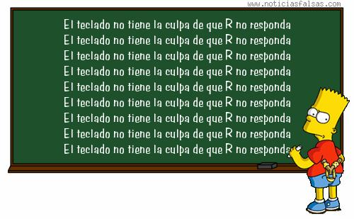

# R15 Loops {-}


## Loops: paso a paso
En este ejemplo vamos a analizar la conveniencia de utilizar loops cuando realizamos tareas repetida. 

Supongamos que tenemos los siguientes datos

```{r}
x <- matrix(rnorm(1000, 10, 1), ncol= 10) # una matríz de diez columnas, con números aleatorios con distribución de error normal con media 10 y varianza 1
```

Ahora queremos generar una figura compuesta con histogramas de los valores de cada una de las columnas de x, indicando en cada figura cuál es la columna que se está graficando. Para lo cual generamos una ventana grafica y damos los comandos de diez histogramas, como se muestra a continuación.

```{r, echo= T}
nombres <- paste("columna", 1:10) # rótulo para indicar cuál es la columna que se está graficando
```

```{r, echo= T}
if (Sys.info()['sysname'] == "Windows") windows() else x11() ## abre una ventana gráfica usando la función windows() si tu sistema operativo es windows() o x11() si tu sistema operativo es linux

par(mfrow = c(5,2), mar= c(3, 3, 1, 1))
#figura 1
hist(x[ ,1], main= "")
par(usr= c(0,10,0,10)) #redefinimos los ejes para poner el rótulo en la misma posición en todas las figuras.
text(x= 2, y= 8, nombres[1]) #rótulo indicando la columna que se está graficando

#figura 2
hist(x[ ,2], main= "")
par(usr= c(0,10,0,10))
text(x= 2, y= 8, nombres[2])

#figura 3
hist(x[ ,3], main= "")
par(usr= c(0,10,0,10))
text(x= 2, y= 8, nombres[3])

#figura 4
hist(x[ ,4], main= "")
par(usr= c(0,10,0,10))
text(x= 2, y= 8, nombres[4])

#figura 5
hist(x[ ,5], main= "")
par(usr= c(0,10,0,10))
text(x= 2, y= 8, nombres[5])

#figura 6
hist(x[ ,6], main= "")
par(usr= c(0,10,0,10))
text(x= 2, y= 8, nombres[6])

#figura 7
hist(x[ ,7], main= "")
par(usr= c(0,10,0,10))
text(x= 2, y= 8, nombres[7])

#figura 8
hist(x[ ,8], main= "")
par(usr= c(0,10,0,10))
text(x= 2, y= 8, nombres[8])

#figura 9
hist(x[ ,9], main= "")
par(usr= c(0,10,0,10))
text(x= 2, y= 8, nombres[9])

#figura 10
hist(x[ ,10], main= "")
par(usr= c(0,10,0,10))
text(x= 2, y= 8, nombres[10])
```

Muy bien, para hacerlo escribimos los comandos para hacer un histograma, luego lo copiamos 9 veces y reemplazamos en la indexación de cada caso por la columna y el nombre de la columna correspondiente. NO es tanto trabajo después de todo. Sin embargo, ahora vemos que la leyendas de los ejes no son las que nos gustaría tener, y el color no nos convence. Tendríamos entonces que editar uno por uno los comandos para modificar cada histograma. Esto además de ser tedioso aumenta las chances de que cometamos errores.

Una opción un poco más saludable es generar una sola vez los comandos e ir cambiando los valores de indexación (donde dice REEMPLAZAR en el código que sigue). Cada vez que lo corramos se irán completando los paneles de nuestra figura múltiple hasta que completemos los 10 histogramas

```{r, eval= F, echo= T}
if (Sys.info()['sysname'] == "Windows") windows() else x11() 

par(mfrow = c(5,2), mar= c(3, 3, 1, 1))
#figura
hist(x[ ,REEMPLAZAR], main= "")
par(usr= c(0,10,0,10)) 
text(x= 2, y= 8, nombres[REEMPLAZAR]) #rótulo indicando la columna que se está graficando
```

Para optimizar un poco más podríamos hacer la indexación usando un índice, que podríamos llamar _i_. En cada caso podríamos entonces dar valores a _i_ de uno a 10, según corresponda en cada caso. La ventaja es que tendríamos que escribir una sola vez el valor de _i_ en cada figura y no necesitamos "tocar" el código, de hecho podemos dar valores de _i_ en consola

```{r, eval= F}
if (Sys.info()['sysname'] == "Windows") windows() else x11() 
par(mfrow = c(5,2), mar= c(3, 3, 1, 1))

i = 5 # VAMOS CAMBIANDO LOS VALORES DE _i_ de 1 a 10, uno por vez y volvemos a correr desde acá hasta donde dice ## FINAL !!!!!!!

#figura
hist(x[ ,i], main= "")
par(usr= c(0,10,0,10))
text(x= 2, y= 8, nombres[i])

## FINAL
```

Muy bien, avanzamos bastante, ahora podríamos cambiar cualquier argumento del plot y simplemente deberíamos repetir estos pasos otra vez 10 veces. Pero mejor todavía, podríamos dar los comandos adecuados para que las repeticiones las haga R!!!! Aquí es donde vienen los loop en nuestra ayuda. En las siguientes líneas de comando reemplazar los tres puntos por lo que corresponda para que el loop haga la tarea por nosotros

```{r, eval= F}
if (Sys.info()['sysname'] == "Windows") windows() else x11() 

par(mfrow = c(5,2), mar= c(3, 3, 1, 1))

for(i in ...){

#figura
hist(x[ ,...], main= "")
par(usr= c(0,10,0,10))
text(x= 2, y= 8, nombres[...])

} ## FINAL
```

<!-- RTA -->
```{r, include= F}
if (Sys.info()['sysname'] == "Windows") windows() else x11() 

par(mfrow = c(5,2), mar= c(3, 3, 1, 1))

for(i in 1:10){

#figura
hist(x[ ,i], main= "")
par(usr= c(0,10,0,10))
text(x= 2, y= 8, nombres[i])

} ## FINAL
```


## loop muy sencillo (R)
Asignar el vector letters a un objeto que llamaremos **_miX_**

```{r, comment=""}

miX <- letters 
miX

```

a) Generar un loop que itere sobre el vector **_miX_** y que en cada iteración muestre en pantalla la palabra "letra:" y la letra que corresponda, como se muestra a continuación

<!-- RTA -->
```{r, include= F}
for(i in miX)  print( paste("letra:", i, sep= " ") )
```

Estructura 

```{r, eval=F}
for(i in miX)  print( paste("letra:", COMPLETAR, sep= " ") )

```

b) Usaremos el mismo objeto **_miX_**, pero ahora se espera que el vector de iteración sea numérico de 1:length(**_miX_**)

Estructura

```{r, eval=F}
n <- length(miX)
for(i in 1:n)  print( paste("letra:", miX[COMPLETAR], sep= " ") )

```

c) Modificar el loop del punto _b)_ para que también se imprima en pantalla la iteración que corresponda, como se muestra a continuación

```{r, echo= F, eval= T}
n <- length(miX)
for(i in 1:n)  print( paste("letra:", miX[i], "iteración:", i, sep= " ") )
```

## Figura múltiple (RR)

Queremos evaluar visualmente cambios en la dispersión de un conjunto de datos aleatorios, con distribución normal, cuando modificamos el valor de sigma. Sabemos que la siguiente función nos va a dar 100 valores aletorios con estructura de error normal, con media= 10 y desvío estandar = 1

```{r, comment=""}
miX <- rnorm(100, 10, 1)
hist(miX)
```

El objetivo es generar mediante un loop una figura de paneles múltiples (4 filas y dos columnas), donde en cada panel se graficará un histograma con distribuciones normales de 100 valores, con media= 10. Cada figura tendrá un valor de sd definido a priori de acuerdo al vector miSD, como se muestra a continuación

<!-- RTA -->
```{r, echo= F}

## RTA
set.seed(333)
miSD <- seq(from= 0.5, to= 4, by= 0.5)
par(mfrow= c(4,2), mar= c(3, 1, 1, 1) ) #definimos los paneles y márgenes de las figuras

  for (i in miSD){
    miX <- rnorm( 100, 10, sd= i )
    hist(miX, main= "", ylab="", xlim= c(-5, 30))
    }
```

Estructura

```{r, eval= F}
set.seed(333) # definimos la semilla para que todos obtengamos los mismos números pseudoaleatorios

miSD <- seq(from= 0.5, to= 4, by= 0.5) # valores de sd que queremos evaluar

par(mfrow= c(4, 2), mar= c(3, 1, 1, 1) ) #definimos los paneles y márgenes de las figuras

  for (i in miSD){
    miX <- rnorm( 100, 10, sd= COMPLETAR )
    hist(miX, main= "", ylab="", xlim= c(-5, 30))
    }
```

## Figura múltiple con leyenda (RRR)
Dado que usamos par(mfrow) en el ejercicio anterior sabemos que los valores de sd se fueron completando por filas. Pero el lector, reviewer, etc. no tiene acceso al script. ¿Que tal si en cada figura agregamos una leyenda con el valor de sd utilizado?. El resultado debería verse como en la siguiente figura

<!-- RTA -->
```{r, echo= F}

set.seed(333)
miSD <- seq(from= 0.5, to= 4, by= 0.5)
par(mfrow= c(4,2), mar= c(3, 1, 1, 1) ) #definimos los paneles y márgenes de las figuras

  for (i in miSD){
    miX <- rnorm( 100, 10, sd= i )
    hist(miX, main= "", ylab="", xlim= c(-5, 30))
    par( usr= c(0, 10, 0, 10) )
    text(x= 2, y= 9, paste("sd:", i, sep=" "))
    }
```

Estructura

Recordemos que con par(usr= c(0, 10, 0, 10)) reescaleamos nuestra figura para independizarnos de los valores de los ejes _x_ y _y_  (ver R10.Gráficos2)

```{r, echo= T, eval= F}
## RTA
set.seed(333)
miSD <- seq(from= 0.5, to= 4, by=0.5)
par(mfrow= c(4,2), mar= c(3, 1, 1, 1) ) #definimos los paneles y márgenes de las figuras

  for (i in miSD){
    miX <- rnorm( 100, 10, sd= COMPLETAR )
    hist(miX, main= "", ylab="", xlim= c(-5, 30))
    par( usr= c(0, 10, 0, 10) ) ## este comando redefine la escala de los ejes
    text(x= 2, y= 9, paste( COMPLETAR ) ) ## este comando agrega la leyenda en x y y de acuerdo a la nueva escala definida en par(usr)
    }
```

## Efecto de la varianza (RRR)

En un modelo lineal determinístico el valor esperado de una variable dependiente (_y_) en función de una variable independiente (_x_) está dado por:

$$y_{i} = a + b*x_{i}$$  
donde $a$ y $b$ son la ordenada al origen y la pendiente respectivamente

En un modelo estocástico se agrega un componente aleatorio. Por ejemplo, en una relación lineal puede incorporarse como un error aditivo

$$y_{i} = a + b*x + e_{i}$$  
donde  $e_{i}$ es un error aleatorio con media 0 y varianza = sigma²  

Por ejemplo, el siguiente código genera una figura de dos paneles, donde se muestra el modelo determinístico (panel superior) y un modelo estocástico con error aditivo normal, con media = 0 y sd = 3

```{r}
  x <- runif(100, 0, 100) # variable independiente
  ydet <- 0.5 + 3 * x # variable dependiente (modelo determinístico)
  yest <- 0.5 + 3 * x + rnorm(100, 0, 3) # variable dependiente (modelo estocástico)
  
par(mfrow= c(2,1), mar= c(2, 2, 2, 2), oma= c(3, 3, 1, 1) ) 
    
    plot(x, ydet, pch=16)
    abline(a= 0.5, b= 3, lty=2)
    
    plot(x, yest, pch=16)
    abline(a= 0.5, b= 3, lty=2)
    
    mtext(side= 2, "Y", outer= T)
    mtext(side= 1, "X", outer= T)
```

El ejercicio consiste en generar un loop para evaluar el efecto de sd en la dispersión de los datos alrededor del valor medio de y. El objetivo es generar una figura múltiple como la que se muestra a continuación

<!-- RTA -->
```{r, echo= F}

var = c(1, 10, 30, 60, 90, 120)

par(mfrow= c(3,2), mar= c(2, 2, 2, 2), oma= c(3, 3, 1, 1) )

for(i in var) {

  y <- 0.5 + 3 * x + rnorm(100, 0, i) 
  plot(x, y, pch= 16)
	abline(a= 0.5, b= 3, lty=2)
	par( usr = c(0, 10, 0,10) )
	text( paste("varianza", "=", i, sep= " "), x= 2, y= 8)
}
mtext(side= 2, "Y", outer= T)
mtext(side= 1, "X", outer= T)
```

Estructura

```{r, echo=T, comment="", eval= F}

var = c(1, 10, 30, 60, 90, 120)

par(mfrow= c(3,2), mar= c(2, 2, 2, 2), oma= c(3, 3, 1, 1) )

for(i in COMPLETAR) {

  y <- 0.5 + 3 * x + rnorm(100, 0, COMPLETAR) 
  plot(x, y, pch= 16)
  abline(a= 0.5, b= 3, lty=2)
	par( usr = c(0, 10, 0,10) )
	text( paste(COMPLETAR), x= 2, y= 8)
}
mtext(side= 2, "Y", outer= T)
mtext(side= 1, "X", outer= T)
```

## Figuras múltiples (RRRR)

Asignar a un objeto que llamaremos **_env_** la tabla contenida en el archivos DoubsEnv.csv, que se encuentra en la carpeta 4-Datos (la descripción de la base de datos se encuentra en el archivo [
datos_eer.html](datos_eer.html)).   

Hemos visto que mediante el siguiente código podemos generar una figura múltiple de las variables ambientales de env

``` {r, echo=F}
env <- read.table("4-Datos/DoubsEnv.csv", sep=",", header=T, as.is=T)
```

``` {r, echo=T, results='hide'}
par(mfrow= c(5, 2), mar= c(3, 2, 2, 2))
apply(env[ , 5:14], 2, hist, main= "", col= "grey")
```

Sin embargo nos gustaría poder personalizar más la figura. Por ejemplo, agregando el nombre de las variables (en castellano y sin abreviar) y opcionalmente una letra que identifique cada gráfico dentro de la figura general. Recurriremos al uso de un loop para generarlo

<!-- RTA -->
```{r, include= F}
variables <- c("Altura", "Pendiente", "Descarga", "pH", "Dureza", "Fosfato", "Nitrato", "Amonio", "oxígeno", "Oxígeno disuelto")

subEnv <- env[ , 5:14]
par( mfrow= c(5, 2), mar= c(4, 2, 1, 1), oma= c(2, 3, 1, 1) )
  for (i in 1:ncol(subEnv)) {
  tg <- subEnv[ ,i]
  hist(tg, main= "", xlab = variables[i], col= "grey" )
  par(usr= c(0, 10, 0, 10))
  text(paste("(", letters[i]), x= 8.8, y= 8)
  }
  mtext(side= 2, "Frecuencia", outer= T)
```

Lineamientos  
* Hacer un subset del objeto env con las columnas 5:14  
* Generar un vector con los nombres de las variables  (en castellano), como se  muestra más abajo  
* Dar las opciones del par() para la figura múltiple   
* Definir las condiciones iniciales del loop ( for i in ... )   
* Seleccionar la columna de la variable de la iteración correspondiente   
* Realizar el histograma   
* Agregar el texto   
* Fin del loop  
* Leyenda "Frecuencia" en el eje y, común a todos los gráficos

```{r, echo=T, eval= F}
variables <- c("Altura", "Pendiente", "Descarga", "pH", "Dureza", "Fosfato", "Nitrato", "Amonio", "oxígeno", "Oxígeno disuelto")

subEnv <-  ### subset de env con todas las filas y las columnas 5:14
par( mfrow= c(5, 2), mar= c(4, 2, 1, 1), oma= c(2, 3, 1, 1) )
   for(i in ....){
     tg <- # un objeto con la columna i de subEnv
     hist(tg, .......) # entre los argumentos debería estar el nombre de la variable i
     par( usr(.....) )
     text( ...... ) # entre los argumentos debería estar la letra (a, b c, d, etc.) correspondiente a la variable i
     }
  mtext(.....) # leyenda del eje Y "Frecuencia"
``` 

## Multiples archivos gráficos (RRRR)

Re diseñar el loop del ejercicio anterior, pero en vez de generar una figura múltiple se deberá guardar el histograma de cada una de las variables como archivo de imagen (jpg). El nombre de la variable deberá estar compuesto por el siguiente código: hist_variable<sub>_i_</sub>.jpg. Donde variable<sub>_i_</sub> es el nombre de la variable correspondiente a la iteración _i_

<!-- RTA -->

```{r, eval= F, include= F}
variables <- c("Altura", "Pendiente", "Descarga", "pH", "Dureza", "Fosfato", "Nitrato", "Amonio", "oxígeno", "Oxígeno disuelto")

subEnv <- env[ , 5:14]
for (i in 1:ncol(subEnv)) {
  tg <- subEnv[ , i]
  jpg(paste("Figuras/hist", "_", "variable", "_", i, ".jpg"), type="jpeg")
  hist(tg, main= "", xlab = variables[i], col= "grey", ylab= "Frecuencia" )
  }

```

## Helping Bart (RRR)
La siguiente figura muestra la típica penitencia aplicada a Bart Simpson
{width=400px height=360px} 